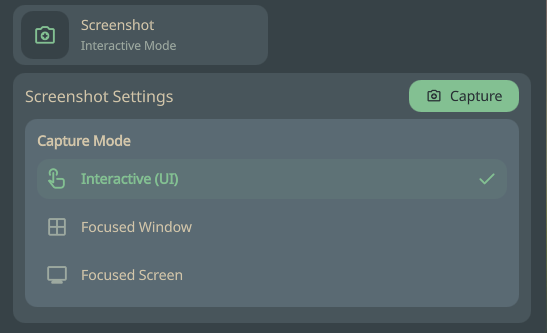
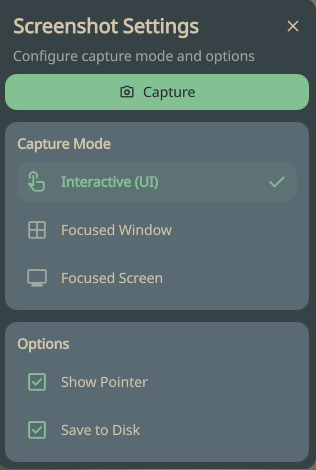

# Niri Screenshot

A [DMS (Dank Material Shell)](https://github.com/nicknisi/dank-material-shell) plugin for controlling Niri screenshot actions directly from the Control Center and bar widget.

## Features

- **Multiple Capture Modes**
  - **Interactive (UI)** — open the Niri interactive screenshot selector
  - **Focused Window** — capture the currently focused window
  - **Focused Screen** — capture the currently focused screen

- **Options**
  - **Show Pointer** — include or hide the mouse cursor in screenshots
  - **Custom Path** — optionally set an absolute path for saving screenshots

- **Control Center Integration** — quick access tile with a detail panel for settings
- **Bar Widget** — compact pill for the horizontal and vertical bar
- **Popout Panel** — dedicated settings popout when clicking the bar widget
- **Dedicated Settings Page** — full settings page accessible from the DMS settings panel

## Screenshots

### Control Center


### Bar Widget


## Installation

Copy or symlink this directory into the DMS plugins folder:

```bash
ln -s /path/to/dms-niri-screenshot ~/.config/DankMaterialShell/plugins/dms-niri-screenshot
```

Then reload DMS:

```bash
dms kill && dms run -d
```

## Requirements

- [Niri](https://github.com/YaLTeR/niri) compositor
- [DMS](https://github.com/nicknisi/dank-material-shell) v1.4+

## License

MIT
